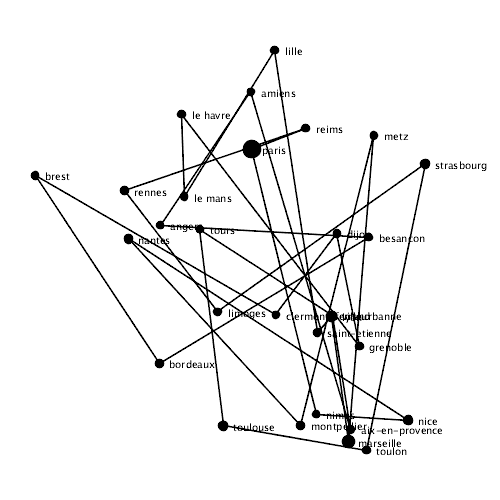

# simulated-annealing

The goal in this [Processing](https://processing.org/) experiment is the implementation of [Simulated Annealing](https://en.wikipedia.org/wiki/Simulated_annealing) for the [Traveling Salesman Problem](https://en.wikipedia.org/wiki/Travelling_salesman_problem) for a set of cities. Simulated Annealing is a stochastic optimization approach that is able to overcome local minima through random perturbations which are biased towards minimizing an energy function. The energy function in this example describes the total distance of all the connections between the cities.

The data set for this experiment is from [Maxmind](https://www.maxmind.com/en/free-world-cities-database) from which the latitude, longitude and population values are used. The coordinates of the data set are projected with the [Web Mercator](https://en.wikipedia.org/wiki/Web_Mercator) projection.

